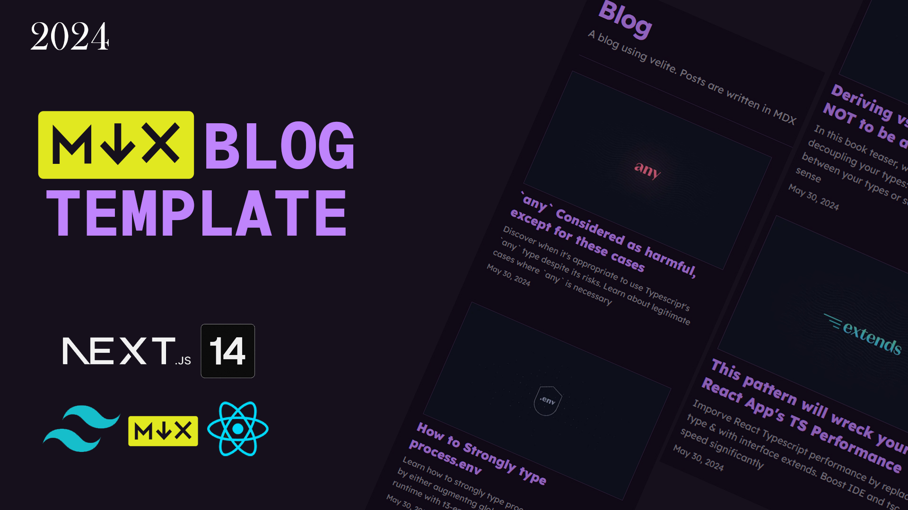

# MDX Static Blog Template

MDX Blog Template is a simple implementation of a markdown static blog. Built with Next.js 14 and velite js.



## Table of Contents

- [Features](#features)

- [Used Technologies](#used-technologies)

- [Run Locally](#run-locally)

## Features

- MDX Components

- Responsive design built using `shadcn/ui` and `tailwindcss`

- Syntax Highlighting of code.

## Used Technologies

- `Next.js`: Harness the power of Next.js, leveraging its static site generation (SSG) capabilities to create a user interface.

- `shadcn/ui`: Enhance your app's visual and interactive elements with components from shadcn/ui. These beautifully designed components can be seamlessly integrated into your application, offering accessibility, customizability, and open-source goodness.

- `Tailwind CSS`: Employ Tailwind CSS for efficient styling, enabling rapid development through its utility-first approach and streamlined design workflow.

- `Markdown`: MDX lets you use JSX in your markdown content. You can import components, such as interactive charts or alerts, and embed them within your content.

- `Velite`: Velite is a tool for building type-safe data layer, turn Markdown / MDX, YAML, JSON, or other files into app's data layer with Zod schema.

## Run Locally

To get a copy of MDX Blog Template up and running on your local machine, follow these steps:

1. **Clone the repository**:

   ```bash
   git clone https://github.com/devbertskie/next-mdx-blog.git
   ```

   After successful cloned. Head over to the project directory

   ```bash
   cd next-mdx-blog
   ```

2. **Install Dependencies**:

   Navigate into the project directory and install the required dependencies:

   ```bash
   npm install
   ```

3. **Run the Development Server**:

   Start the app in development mode with the following command:

   ```bash
   npm run dev
   ```

   Head over to your browser and access the `localhost:3000`

4. **Build the App**:

   To build the app, run the following command:

   ```bash
   npm run build
   ```

---

- **Add New Blog Content**:

  To add new blog content, go to `content` folder and you can add new markdown component in `.mdx` file

  `Important`: Make sure to name the component with dash(`-`) and without space. Example: `my-example-blog.mdx`
